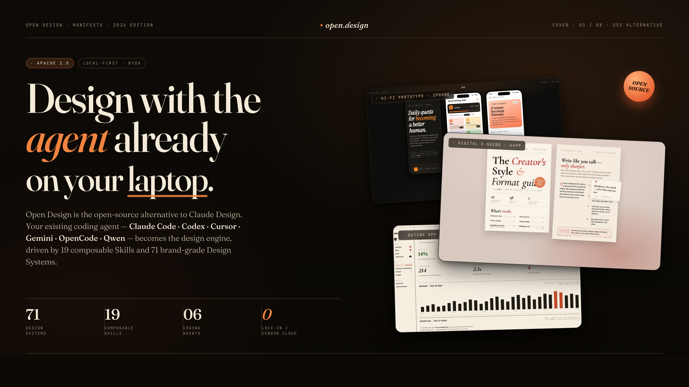
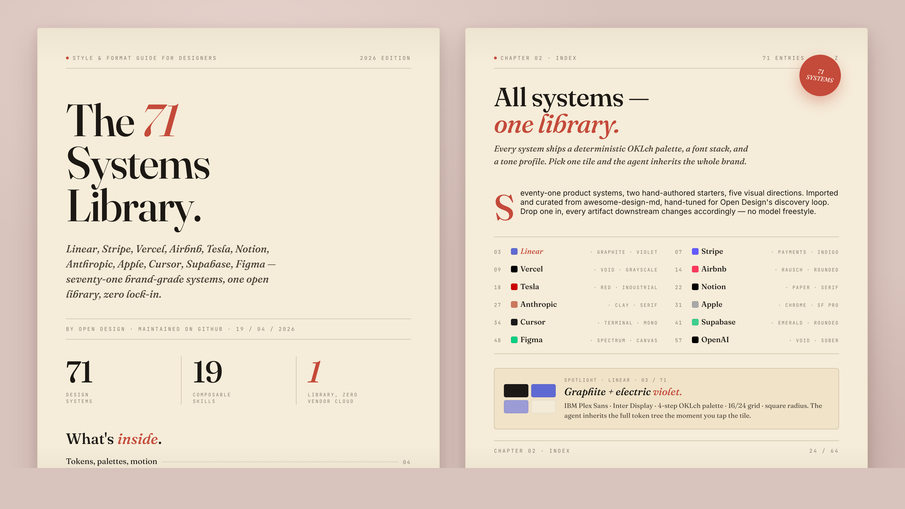

# design-taste — v3.1

> A taste-engine for Claude Code that produces shipped-product quality UI — not LLM default output.

[](https://github.com/nexu-io/open-design)
[](LICENSE)
[](design-taste/SKILL.md)

---



---

## What it does

Most AI-generated UI fails for the same reasons: indigo accents, two-stop gradients, emoji feature icons, ALL CAPS without tracking, and the same Hero → Features → Pricing → CTA skeleton every time.

**design-taste** removes those failure modes with a three-step protocol:

```
Format classification → Specimen selection → Universal craft rules → Self-critique → Emit
```

1. **Routes by format first** — a landing page and a carrousel look similar but obey completely different rules. The skill classifies the artifact's *shape* before its *aesthetic*.
2. **Picks a proven specimen** — each format class has 2–4 real-world reference designs decomposed into reusable rules (typography, palette, layout, component patterns, banned moves).
3. **Applies 9 universal craft rules** — letter-spacing, weight system, palette layers, state coverage, motion discipline, UX laws, accessibility baseline, anti-slop checks (P0 + P1), and a two-tier reflex test.
4. **Self-critiques on 5 dimensions** before showing output. If 2+ dimensions score below 6, it rewrites before emitting.

---

## The ratio that produces taste

> ~80% proven patterns + ~20% distinctive choice.

The 20% lives in exactly one of:
- One bold visual move — a typography choice, an unexpected proportion, a single color decision
- Voice and microcopy — "Start tracking" beats "Get started"
- One micro-interaction — a button that moves 2px on press, a number that counts up
- One detail only someone who used the product would put there

Pick one. Not five. The rest stays conventional.

---

## Installation

### Option A — Folder (recommended)

Drop the `design-taste/` folder into your agent's skills directory:

```bash
# Claude Code
cp -r design-taste/ ~/.claude/skills/

# Or point to it directly
SKILLS_DIR=./design-taste claude
```

### Option B — Zip

Download [`design-taste-v3.1.zip`](design-taste-v3.1.zip) and extract into your skills directory.

### Option C — One-liner

```bash
gh repo clone Raunaks068619/design-taste && cp -r design-taste/design-taste ~/.claude/skills/
```

---

## Usage

Once installed, invoke the skill from any coding agent:

```
/design-taste
```

The skill emits a **brief-lock form** on the first turn — 5–7 questions that lock in format, surface, audience, tone, and brand context before any CSS is written.

```
Brief lock — 30 seconds. I'll lock these in before building.
Skip what doesn't apply — I'll fill defaults.

1. What are we making? (Carrousel / Landing / Dashboard / Component / Poster / Deck / Email / Social)
2. Primary surface? (Mobile / Desktop / Both / Fixed canvas)
3. Who is this for? (one line)
4. Visual tone? (editorial / minimal / brutalist / friendly / luxury / playful / utility)
5. Brand context? (pick a direction / I have a brand spec / specific specimen name)
6. Roughly how much? (e.g. "8 slides", "1 landing + 3 sub-pages")
7. Anything to avoid?
```

Smart-skip: if your brief already answers 4+ of 7 fields, the skill emits a condensed confirmation instead of the full form.

---

## Format classes

| Format | Canvas | When to use |
|---|---|---|
| Instagram Carrousel | 1080×1350px, swipe | Social post, educational series |
| Website Landing Page | 1440px+, mobile collapse | Product launch, SaaS homepage |
| SaaS Dashboard | Application UI, dense data | Analytics, admin, monitoring |
| Component / UI Mockup | Single screen showcase | Spec handoff, design review |
| Poster / Print | Single image, no scroll | Event, brand, campaign |
| Pitch Deck / Slides | 16:9 or 9:16, 8–15 slides | Fundraising, sales, internal |
| Email / Newsletter | 600–640px, table-based | Outreach, digest, announcement |
| Social Static | 1080×1080 or 1200×630 | Single-frame post |

---

## The seven cardinal sins (P0 — never)

Any one of these = artifact regression, regardless of specimen.

| # | Sin | Why it fails |
|---|---|---|
| 1 | Default Tailwind indigo (`#6366f1`, `#4f46e5`, `#8b5cf6`...) | The textbook AI tell. Use `--accent` from the specimen DESIGN.md |
| 2 | Two-stop "trust" gradient on the hero | Purple→blue, blue→cyan, indigo→pink. A flat surface + type beats it |
| 3 | Emoji as feature icons | `✨ 🚀 🎯` inside headings or buttons. Use 1.6–1.8px monoline SVG |
| 4 | Sans-serif on display when specimen binds a serif | H1/H2 must use `var(--font-display)` |
| 5 | Rounded card with colored left-border accent | The canonical AI dashboard tile. Drop the radius or the border |
| 6 | Invented metrics | "10× faster", "99.9% uptime" — pull from real source or label as placeholder |
| 7 | Filler copy | `lorem ipsum`, `feature one / two / three` — a composition problem, not a word problem |

---

## Typography system

The single most-skipped rule in AI-generated design.

```
Letter-spacing      | Context
--------------------|----------------------------------------
0                   | Body 14–18px
+0.01 to +0.02em    | Small 11–13px
+0.02em             | UI labels, button text
+0.06 to +0.10em    | ALL CAPS — required, no exceptions
0 to -0.01em        | Subheadings H2/H3 20–31px (Emphasize weight)
-0.01 to -0.02em    | Headings H1 32px+
-0.02 to -0.03em    | Display 48px+
```

Three-weight system: **Read** (400/450) · **Emphasize** (510/550) · **Announce** (590/600)

ALL CAPS without ≥0.06em tracking is the single most reliable AI-slop tell. Display text without negative tracking is the second.

---

## Sample outputs

> Outputs generated via [open-design.ai](https://open-design.ai) — the official runtime for design-taste specimens.

### SaaS Landing Page — editorial-technical specimen



*Type-led landing page using the editorial-technical specimen: tight typographic grid, monochrome surface with a single accent, monoline SVG icons. Generated with the `linear-app-saas` direction.*

---

### Design Systems Library — specimen board

The skill routes across a curated board of specimens. Each entry includes:
- Substrate (background, surface, border treatment)
- Display + body + mono font stacks
- Accent palette (OKLCH tokens)
- Component pattern rules
- Banned moves (per-specimen)

```
Specimen: editorial-technical
Direction: linear-app-saas
Audience: dev-twitter
Tone: utility / minimal
Surface: 1440px desktop with mobile collapse
Accent: oklch(55% 0.15 250)  ← single accent, ≤2 visible uses per screen
Display: Berkeley Mono / JetBrains Mono
Body: Inter / system-ui
```

---

### Pitch Deck — guizang-editorial specimen

```
Specimen: deck-guizang-editorial
Direction: magazine-swiss
Audience: early-stage investors
Tone: editorial / luxury
Surface: 16:9, 10 slides
Accent: oklch(48% 0.12 30)  ← warm rust
Display: Playfair Display / Cormorant
Body: Neue Haas Grotesk / Inter
```

Section list: `cover → problem → market → product walkthrough → traction → team → ask → appendix`

*Apply: Hick's Law (cap visible primary options to 3–5), Peak-End Rule (traction slide carries the emotional peak, ask slide closes the arc)*

---

### Instagram Carrousel — higgsfield-friendly-editorial specimen

```
Specimen: higgsfield-friendly-editorial
Direction: warm-editorial
Audience: design-twitter
Tone: playful / editorial
Surface: 1080×1350px, 6 slides
Accents: oklch(58% 0.15 35) terracotta + oklch(75% 0.18 120) chartreuse
Display: Recoleta / Freight Display
Body: Söhne / system-ui
```

*Two accents as a signature — this is the scoped exception in the color system. Sticker-style headers, not feature icons.*

---

## Self-critique dimensions

Before emitting, the skill scores 5 dimensions 0–10 with evidence. If 2+ score below 6, it rewrites.

| # | Dimension | What it asks |
|---|---|---|
| 1 | Philosophy consistency | Does every micro-decision argue for the same thesis? |
| 2 | Visual hierarchy | Can a stranger identify what to read first, second, third? |
| 3 | Detail execution | Alignment, leading, kerning, edge-case spacing |
| 4 | Functionality | CTA above fold, mobile reflow, all five UI states |
| 5 | Innovation | Is there one element that makes people lean in? |

Bands: 0–4 broken · 5–6 functional · 7–8 strong · 9–10 exceptional

Mean above 8 across all 5 is suspicious. Don't grade-inflate.

---

## Second-order reflex check

Passing the seven sins is necessary, not sufficient.

**First-order:** Can someone guess the theme + palette from the product category alone?
*"observability → dark blue", "healthcare → white + teal", "fintech → navy + gold"*
If yes → rework.

**Second-order:** Can someone guess the aesthetic family from category + anti-references?
*"AI workflow tool that's not SaaS-cream → editorial-typographic"*
If yes → you avoided the first reflex and landed in the one beneath it. Rework.

Soul test: can you name a specific shipped product this could pass for? If yes → soul. If you can only name an aesthetic school → still a reflex.

---

## File structure

```
design-taste/
├── SKILL.md                  ← main skill file (routing protocol, craft rules, hard contract)
└── references/
    ├── board.md              ← design board: format classes, specimens, disambiguator tables
    ├── craft.md              ← full craft rules: typography, color, motion, state, accessibility
    ├── critique.md           ← 5-dim review workflow, scoring discipline
    ├── directions.md         ← 5 deterministic visual directions (OKLCH palettes + font stacks)
    └── laws-of-ux.md         ← full UX-laws inventory with primary sources
```

---

## Synced with

This skill is maintained in sync with:

- **[nexu-io/open-design](https://github.com/nexu-io/open-design)** — craft rules, anti-slop rules, typography system, motion discipline, state coverage (last synced May 2026)
- **[refero_skill](https://github.com/referodesign/refero_skill)** (MIT) — original taste-engine concept
- **[Leonxlnx/taste-skill](https://github.com/Leonxlnx/taste-skill)** — specimen routing approach

Primary research grounding: WCAG 2.2, Material 3 motion tokens, Bringhurst *Elements of Typographic Style* §3.2.7, Tversky/Morrison/Bétrancourt 2002 (motion), Yablonski Laws of UX, Baymard Institute checkout research.

---

## License

MIT — see [LICENSE](LICENSE)
